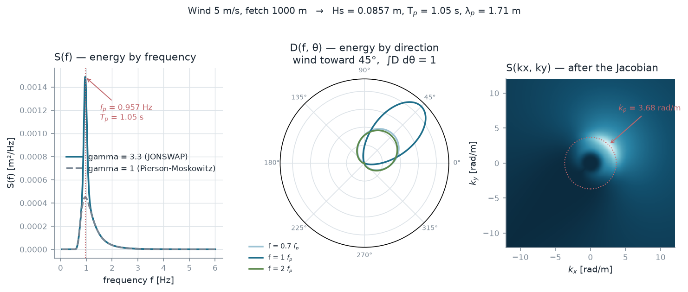
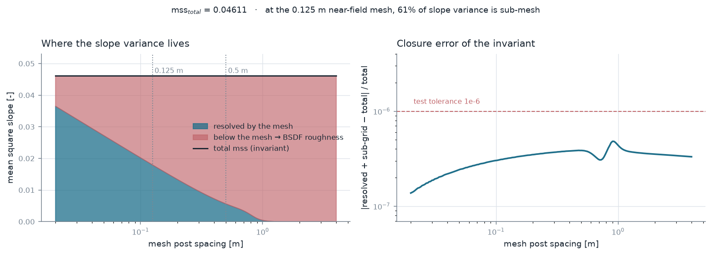
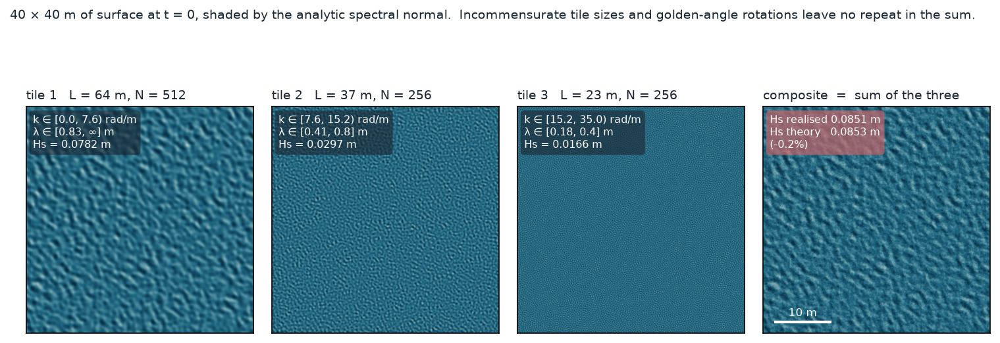
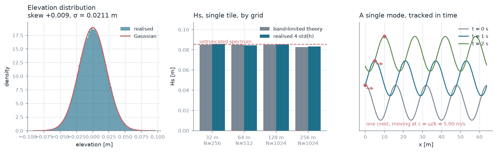
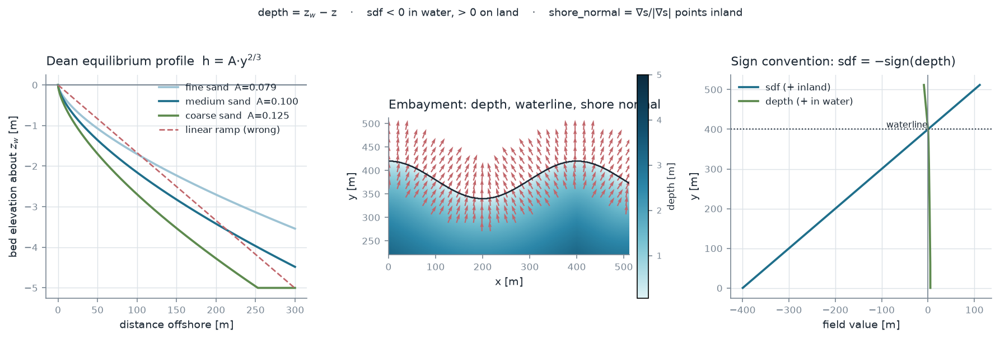
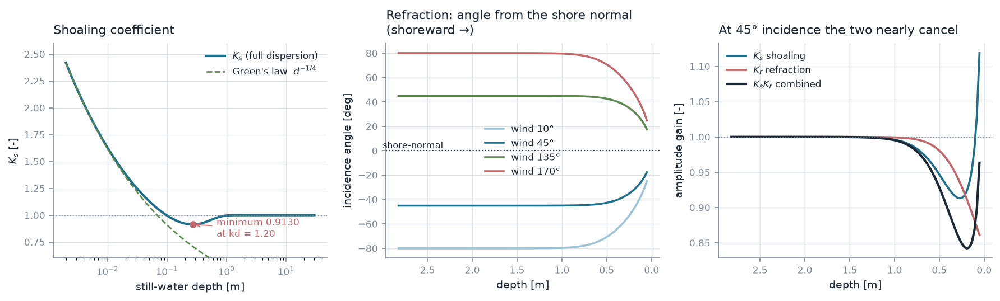
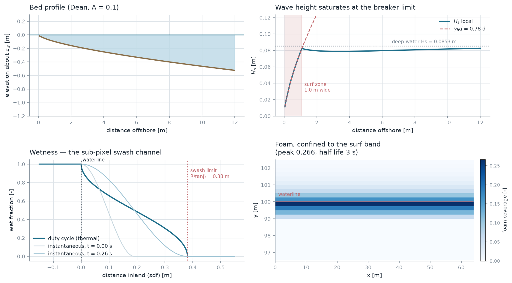
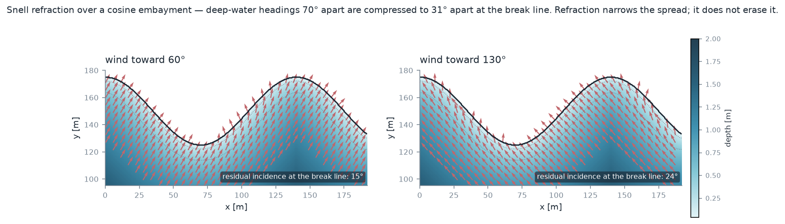

# pywave — what the model does, in eight figures

A visual tour of Phases 1–3 and 5 for readers who will not run the code.

Everything here is computed live from `pywave` when the script runs — no number is copied in by hand. A figure that disagrees with [validation_report.md](validation_report.md) therefore means the code changed, not that the picture went stale.

```
python scripts/make_figures.py            # rebuild all of it
python scripts/make_figures.py --list     # what is available
```

**Scene throughout:** `configs/test_lake.yaml` — 5 m/s wind over 1 km of fetch, giving Hs = 8.6 cm and a 1.05 s peak period. A small lake, deep water everywhere except the last few metres.

---

## 1 · The spectrum, and everything that comes from it



The JONSWAP spectrum and its directional spreading — the single source of truth from which every other quantity in the package is derived.

---

## 2 · The LOD invariant



The LOD invariant. Slope variance lost when the mesh coarsens is not lost — it is handed to the BSDF as sub-facet roughness, so the total is conserved across every level of detail.

---

## 3 · The synthesised surface



One realisation of the composite surface. Three tiles of incommensurate size, each carrying a disjoint band of the spectrum and rotated by a multiple of the golden angle, so no repeat pattern survives in the sum.

---

## 4 · Does the surface match the spectrum it was built from?



The realised surface reproduces the spectrum it was built from: Gaussian elevations, the right variance, and crests travelling at the right speed.

---

## 5 · The synthetic beach



The synthetic Dean beach that Phase 5 is validated against. It satisfies the same field contract Houdini will export in Phase 4, so swapping in real terrain is a loader change rather than a physics change.

---

## 6 · Shoaling and refraction coefficients



Shoaling and refraction coefficients, both solved against the full dispersion relation and both checked against closed-form answers — Green's law and Snell's law.

---

## 7 · Through the surf zone



A transect through the surf zone. Wave height saturates at the depth-limited breaking criterion, foam is seeded where waves break and swept shoreward, and the wetness channel carries the sub-pixel swash as a duty cycle.

---

## 8 · Refraction on a curved shoreline



Refraction on a curved shoreline, in the band where it actually acts. Two very different wind directions produce nearly the same near-shore wave heading, because each ray turns toward its own local contour.

---

## Where this sits

| Phase | Status |
|---|---|
| 1 — spectrum, spreading, moments | implemented |
| 2 — FFT synthesis, multi-tile composition | implemented |
| 3 — validation suite and generated V&V report | implemented |
| 4 — Houdini terrain | not started; figure 5 is the synthetic stand-in |
| 5 — shoaling, refraction, breaking, foam | implemented |
| 6–10 — mesh export, BSDF, emissivity, integration | not started |

See the [user's guide](users_guide.md) for the API and conventions, and the [validation report](validation_report.md) for every measured number with the reference it was judged against.
